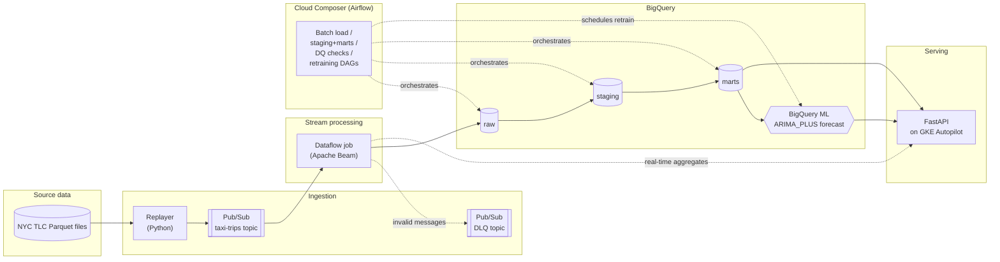

# TaxiPulse

> **Status: Work in progress.** This is an active portfolio project. Phase 0 (project
> scaffolding) is complete; streaming ingestion, processing, warehousing, orchestration,
> and the serving API are being built incrementally, one phase per session. See
> [Roadmap](#roadmap) below for what's done and what's next.

An end-to-end real-time urban mobility data platform on Google Cloud, built on real
NYC TLC (Taxi and Limousine Commission) trip data. TaxiPulse replays historical taxi
trips as a live event stream, processes them with Apache Beam on Dataflow, warehouses
and forecasts demand with BigQuery and BigQuery ML, orchestrates batch and ML workflows
with Cloud Composer, and serves real-time KPIs and forecasts through a FastAPI service
on GKE Autopilot.

## Overview

- **Source data**: [NYC TLC Trip Record Data](https://www.nyc.gov/site/tlc/about/tlc-trip-record-data.page)
  (public Parquet files).
- **Replay**: a Python replayer reads historical trips and publishes them to Pub/Sub in
  chronological order, at a configurable speed-up factor, with optional late/duplicate
  event injection to test pipeline robustness.
- **Stream processing**: Apache Beam (Python SDK) on Dataflow parses, validates,
  deduplicates, and windows events, computing per-zone aggregates and detecting demand
  spikes, with dead-lettering for invalid messages and explicit late-data handling.
- **Warehouse**: BigQuery organized in raw / staging / marts layers, with a
  geography-enriched taxi zone table (BigQuery GIS) and a per-zone, per-hour demand
  forecasting model trained with BigQuery ML.
- **Orchestration**: Cloud Composer (Airflow) drives batch historical loads,
  staging/marts transformations, data quality checks, and scheduled model retraining.
- **Serving**: a containerized FastAPI service exposes real-time KPIs, detected spikes,
  and demand forecasts, deployed on GKE Autopilot.
- **Infra & CI/CD**: everything is provisioned with Terraform and deployed via GitHub
  Actions, authenticating to GCP through Workload Identity Federation (no JSON keys).

## Architecture



## Tech stack

| Layer               | Technology                                              |
|---------------------|----------------------------------------------------------|
| Event replay        | Python, `pyarrow`, `google-cloud-pubsub`                 |
| Messaging           | Cloud Pub/Sub (local: Pub/Sub emulator)                  |
| Stream processing   | Apache Beam (Python SDK), Cloud Dataflow / DirectRunner   |
| Warehouse           | BigQuery (raw / staging / marts), BigQuery GIS, BigQuery ML |
| Orchestration       | Cloud Composer / Apache Airflow (local: Docker Compose)  |
| Serving API         | FastAPI, Uvicorn, Docker                                 |
| Compute (API)       | GKE Autopilot, Artifact Registry                          |
| Infrastructure      | Terraform                                                 |
| CI/CD               | GitHub Actions, Workload Identity Federation              |
| Quality             | ruff, pytest, pre-commit                                   |

## Getting started

### Prerequisites

- Python 3.11+
- [Make](https://www.gnu.org/software/make/)
- A GCP project (for later phases) — no cloud resources are required for local
  development

### Local setup

```bash
git clone https://github.com/sanogomamadou/TaxiPulse.git
cd TaxiPulse
python -m venv .venv && source .venv/bin/activate   # or .venv\Scripts\activate on Windows
make install
cp .env.example .env   # fill in values as needed
```

### Common commands

```bash
make lint          # ruff checks
make format        # auto-fix + format
make test           # run pytest suite
make sample-data    # download a small local sample of NYC TLC trip data
make destroy        # destroy all GCP resources provisioned via Terraform
```

### Running the streaming stack locally

No GCP project is needed for this - everything runs against a local Pub/Sub
emulator (Docker) and Apache Beam's DirectRunner.

```bash
make sample-data                          # download a small TLC sample into data/sample/
make emulator-up                          # start the local Pub/Sub emulator
make emulator-setup                       # create the taxi-trips topic/subscription
make pipeline-local                       # start the Beam pipeline (DirectRunner), in one terminal
make replay SAMPLE=data/sample/yellow_tripdata_2024-01_sample.parquet ARGS="--speedup 600"
                                           # replay the sample into Pub/Sub, in another terminal
make emulator-down                        # stop the emulator when done
```

Zone aggregates and dead-lettered messages are written as JSON Lines under
`output/`.

## Roadmap

- [x] **Phase 0** — Monorepo scaffolding, `CLAUDE.md`, README, Makefile, `pyproject.toml`,
      pre-commit hooks, TLC sample downloader, minimal CI (lint + tests).
- [x] **Phase 1** — Replayer, local Pub/Sub emulator, Apache Beam pipeline on
      DirectRunner (parsing, dead-letter, dedup, watermarks/allowed lateness/
      triggers, sliding-window aggregates, spike detection), with tests.
- [ ] **Phase 2** — Base Terraform, Pub/Sub / BigQuery / Dataflow deployed on GCP.
- [ ] **Phase 3** — BigQuery raw/staging/marts, BigQuery GIS, BigQuery ML forecasting
      model, local Airflow DAGs, short Composer deployment.
- [ ] **Phase 4** — FastAPI service, Docker, GKE Autopilot deployment.
- [ ] **Phase 5** — Full CI/CD, Workload Identity Federation.
- [ ] **Phase 6** — Performance, model quality, and cost measurements; README
      finalization.

## Measured results

_To be filled in during Phase 6: throughput (messages/s), end-to-end latency, data
volume processed, forecasting model accuracy (MAE / MAPE), and infrastructure cost._

## License

MIT
