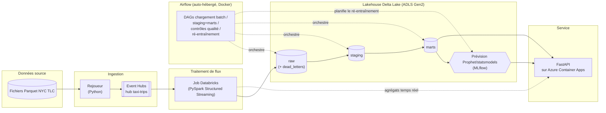

# TaxiPulse

Une plateforme de données de mobilité urbaine temps réel de bout en bout sur
Azure, construite sur de vraies données de trajets NYC TLC (Taxi and
Limousine Commission). TaxiPulse rejoue des trajets de taxi historiques sous
forme de flux d'événements en direct, les traite avec PySpark Structured
Streaming sur Databricks, les entrepose et prévoit la demande avec un
Lakehouse Delta Lake, orchestre les traitements batch et ML avec Airflow, et
sert des KPI et prévisions en temps réel via un service FastAPI sur Azure
Container Apps.

## Vue d'ensemble

- **Données source** : [NYC TLC Trip Record Data](https://www.nyc.gov/site/tlc/about/tlc-trip-record-data.page)
  (fichiers Parquet publics).
- **Rejeu** : un rejoueur Python lit des trajets historiques et les publie
  vers Azure Event Hubs dans l'ordre chronologique, avec un facteur
  d'accélération configurable, et une injection optionnelle d'événements en
  retard/dupliqués pour tester la robustesse du pipeline.
- **Traitement de flux** : PySpark Structured Streaming sur Databricks
  parse, valide, déduplique et fenêtre les événements, calcule des agrégats
  par zone et détecte les pics de demande, avec mise en quarantaine
  (dead-lettering) des messages invalides et une gestion explicite des
  données en retard via les watermarks.
- **Entrepôt de données** : un Lakehouse Delta Lake (raw / staging / marts)
  sur ADLS Gen2, interrogé via Databricks SQL, avec un modèle de prévision
  de la demande par zone et par heure (Prophet/statsmodels, suivi avec
  MLflow).
- **Orchestration** : un Airflow auto-hébergé (Docker) pilote les
  chargements batch historiques, les transformations staging/marts, les
  contrôles qualité des données, et le ré-entraînement planifié du modèle.
- **Service** : un service FastAPI conteneurisé expose les KPI en temps
  réel, les pics détectés et les prévisions de demande, déployé sur Azure
  Container Apps.
- **Infra & CI/CD** : tout est provisionné avec Terraform et déployé via
  GitHub Actions, authentifié auprès d'Azure via des identifiants fédérés
  (OIDC, aucun secret stocké).

## Architecture


```mermaid
flowchart LR
    subgraph Source["Données source"]
        TLC[("Fichiers Parquet NYC TLC")]
    end

    subgraph Ingest["Ingestion"]
        Replayer["Rejoueur\n(Python)"]
        EventHub[["Event Hubs\nhub taxi-trips"]]
    end

    subgraph Stream["Traitement de flux"]
        Databricks["Job Databricks\n(PySpark Structured Streaming)"]
    end

    subgraph Warehouse["Lakehouse Delta Lake (ADLS Gen2)"]
        Raw[("raw\n(+ dead_letters)")]
        Staging[("staging")]
        Marts[("marts")]
        Forecast{{"Prévision Prophet/statsmodels\n(MLflow)"}}
    end

    subgraph Orchestration["Airflow (auto-hébergé, Docker)"]
        DAGs["DAGs chargement batch /\nstaging+marts /\ncontrôles qualité /\nré-entraînement"]
    end

    subgraph Serving["Service"]
        API["FastAPI\nsur Azure Container Apps"]
    end

    TLC --> Replayer --> EventHub --> Databricks
    Databricks --> Raw --> Staging --> Marts
    Marts --> Forecast
    DAGs -. orchestre .-> Raw
    DAGs -. orchestre .-> Staging
    DAGs -. orchestre .-> Marts
    DAGs -. planifie le ré-entraînement .-> Forecast
    Marts --> API
    Forecast --> API
    Databricks -. agrégats temps réel .-> API
```

## Stack technique

| Couche               | Technologie                                              |
|---------------------|----------------------------------------------------------|
| Rejeu d'événements   | Python, `pyarrow`, `azure-eventhub`                       |
| Messagerie           | Azure Event Hubs (local : émulateur Event Hubs)              |
| Traitement de flux   | PySpark Structured Streaming, Databricks / `pyspark` local |
| Entrepôt de données  | Delta Lake sur ADLS Gen2 (raw / staging / marts), Databricks SQL |
| Orchestration        | Apache Airflow, auto-hébergé (Docker Compose, local et déployé) |
| API de service       | FastAPI, Uvicorn, Docker                                 |
| Calcul (API)         | Azure Container Apps, Azure Container Registry              |
| Infrastructure       | Terraform (provider `azurerm`)                             |
| CI/CD                | GitHub Actions, identifiants fédérés Azure (OIDC)          |
| Qualité              | ruff, pytest, pre-commit                                   |

## Démarrage

### Prérequis

- Python 3.11+
- [Make](https://www.gnu.org/software/make/)
- Un abonnement Azure (pour les phases de déploiement) — aucune ressource
  cloud n'est nécessaire pour le développement local
- Pour exécuter le pipeline Spark (`pipeline/`) en local : un **JDK Java
  17+** (Spark 4.x l'exige - configurer `JAVA_HOME` en conséquence) et,
  **sur Windows uniquement**,
  [`winutils.exe` et `hadoop.dll`](https://github.com/cdarlint/winutils)
  dans un répertoire `HADOOP_HOME/bin` également présent dans le `PATH`
  (la couche Hadoop filesystem de Spark en a besoin même pour des chemins
  purement locaux)

### Installation locale

```bash
git clone https://github.com/sanogomamadou/TaxiPulse.git
cd TaxiPulse
python -m venv .venv && source .venv/bin/activate   # ou .venv\Scripts\activate sous Windows
make install
cp .env.example .env   # renseigner les valeurs si besoin
```

### Commandes courantes

```bash
make lint          # vérifications ruff
make format        # correction + formatage automatique
make test           # lance la suite pytest
make sample-data    # télécharge un petit échantillon local de trajets NYC TLC
make destroy        # détruit les ressources Azure éphémères provisionnées par Terraform
```

### Lancer le rejoueur en local

Aucun abonnement Azure n'est nécessaire - le rejoueur tourne contre un
émulateur Event Hubs local (Docker, image officielle
`azure-messaging/eventhubs-emulator` + Azurite).

```bash
make sample-data   # télécharge un échantillon TLC dans data/sample/
make emulator-up    # démarre l'émulateur Event Hubs local + Azurite
make emulator-setup  # vérifie que l'émulateur est joignable et que le hub taxi-trips existe
make replay SAMPLE=data/sample/yellow_tripdata_2024-01_sample.parquet ARGS="--speedup 50000"
make emulator-down   # arrête l'émulateur une fois terminé
```

### Lancer le pipeline Spark en local

`pipeline/` est un lecteur `spark-sql-kafka-0-10` standard contre le
endpoint compatible Kafka d'Event Hubs - la façon idiomatique de consommer
Event Hubs depuis Spark (le connecteur dédié `azure-eventhubs-spark` n'est
plus maintenu et incompatible avec Spark 4.x). Ça fonctionne contre le vrai
Event Hubs Azure ; le port Kafka de l'émulateur local n'a pas pu être rendu
joignable depuis l'hôte lors des tests (voir la docstring de
`pipeline/src/taxipulse_pipeline/main.py`). La logique du pipeline est
malgré tout entièrement vérifiée en local - à la fois via des tests
unitaires (`pipeline/tests/`, DataFrames batch) et une exécution Structured
Streaming réelle contre une source fichier locale en remplacement de la
lecture Kafka.

```bash
python -m taxipulse_pipeline.main \
    --bootstrap-servers <namespace>.servicebus.windows.net:9093 \
    --connection-string "$AZURE_EVENTHUB_CONNECTION_STRING" \
    --eventhub-name taxi-trips \
    --output-path output/zone_aggregates --dead-letter-path output/dead_letters
```

### Lancer le pipeline warehouse en local

Aucun abonnement Azure nécessaire - tout lit/écrit des tables Delta locales
sous `warehouse_output/`.

```bash
make sample-data   # télécharge un échantillon TLC dans data/sample/
make taxi-zones     # télécharge le référentiel de zones TLC + shapefile, construit les centroïdes
make warehouse-zones        # charge le référentiel de zones dans stg_taxi_zones
make warehouse-batch-ingest ARGS="data/sample/yellow_tripdata_2024-01_sample.parquet"
make warehouse-staging
make warehouse-marts
make warehouse-quality       # code de sortie non nul si un contrôle échoue
make warehouse-forecast
```

Les DAGs Airflow pour ce pipeline se trouvent dans `orchestration/dags/` -
chaque tâche appelle les mêmes modules CLI que ci-dessus. `apache-airflow`
est une dépendance optionnelle (`pip install -e ".[airflow]"`, épinglée à
une version exacte pour correspondre à son propre fichier de contraintes).
Un déploiement local complet (Postgres + scheduler/webserver
LocalExecutor, Java + les dépendances Python du warehouse intégrées à
l'image) se trouve dans `orchestration/Dockerfile` +
`orchestration/docker-compose.yml` :

```bash
cd orchestration
docker compose up -d
docker compose exec airflow-scheduler airflow dags unpause taxipulse_batch_pipeline
docker compose exec airflow-scheduler airflow dags trigger taxipulse_batch_pipeline
# Interface Airflow : http://localhost:8080 (admin/admin, dev local uniquement)
docker compose down
```

### Lancer l'API en local

Sert les marts du warehouse et la détection de pics en direct du pipeline
via HTTP - lit les tables Delta directement via `deltalake` (delta-rs), pas
pyspark, donc démarre en moins d'une seconde et ne nécessite aucune JVM.

```bash
# Option A : uvicorn simple, contre le venv principal
make api-dev
# Option B : la vraie image conteneur (celle qui serait déployée sur Container Apps)
make api-build
make api-run
# http://localhost:8000/docs pour la documentation OpenAPI interactive
curl http://localhost:8000/zones/top?limit=5
```

### Mesurer la performance

Produit les vrais chiffres de la section
[Résultats mesurés](#résultats-mesurés) ci-dessous - débit batch, volume et
précision des prévisions à partir d'artefacts locaux, plus le coût Azure
via la vraie API Cost Management (ignoré proprement sans `az login`, non
obligatoire).

```bash
make measure
```

## Feuille de route

- [x] **Phase 0** — Structure du monorepo, `CLAUDE.md`, README, Makefile,
      `pyproject.toml`, hooks pre-commit, téléchargeur d'échantillon TLC, CI
      minimale (lint + tests).
- [x] **Phase 1 (GCP/Beam, archivée)** — Rejoueur, émulateur Pub/Sub local,
      pipeline Apache Beam sur DirectRunner (parsing, dead-letter, dédup,
      watermarks/retard autorisé/déclencheurs, agrégats par fenêtre
      glissante, détection de pics), avec tests. Entièrement construit et
      testé en direct ; préservé sur
      [`archive/gcp-beam`](https://github.com/sanogomamadou/TaxiPulse/tree/archive/gcp-beam).
- [x] **Phase 2 (pivot Azure) — complète, vérifiée de bout en bout contre
      Azure réel** — Rejoueur réécrit pour Event Hubs, émulateur Event Hubs
      local, traitement de flux reconstruit en PySpark Structured
      Streaming (parsing/dead-letter, watermark, dédup, agrégats par
      fenêtre glissante, détection de pics, écriture Delta Lake), Terraform
      pour Event Hubs / ADLS Gen2 / Databricks / identités à privilège
      minimal. Vérifiée en local (tests unitaires, exécution Structured
      Streaming en direct) puis déployée pour de vrai sur un abonnement
      Azure for Students : le rejoueur a publié de vrais événements vers un
      vrai Event Hubs, et le pipeline s'est connecté via le protocole Kafka
      et a tourné sans erreur (après correction d'un écart de palier Event
      Hubs - Basic ne supporte pas Kafka, seulement Standard et
      au-dessus). L'infrastructure a ensuite été détruite
      (`terraform destroy`, propreté confirmée) pour maîtriser le coût.
- [x] **Phase 3 (construction locale) — code complet, vérifiée de bout en
      bout contre un vrai déploiement Airflow local** — Delta Lake
      raw/staging/marts, un référentiel géographique de zones (référentiel
      de zones TLC + centroïdes), prévision de la demande par zone
      (Prophet via un UDF groupé Spark, suivi MLflow), contrôles qualité
      légers, et deux DAGs Airflow (chargement batch quotidien +
      ré-entraînement hebdomadaire). Chaîne complète exécutée deux fois :
      une fois directement sur l'hôte, une fois pour de vrai via un
      Airflow dockerisé (Postgres + scheduler/webserver LocalExecutor, les
      deux DAGs déclenchés et menés à terme) - 2 968 trajets ingérés →
      stagés → 2 727 lignes horaires / 1 187 lignes journalières de
      demande par zone → les 5 contrôles qualité passés → 10 zones prévues
      (MAE moyen 0,28, MAPE moyen 22,4%). Faire tourner le pipeline dans un
      second environnement réellement différent a révélé un vrai bug
      d'idempotence (le hash du trip ID incluait le chemin absolu du
      fichier source, donc le même fichier lu depuis un point de montage
      conteneur comptait chaque trajet en double) qu'une seule exécution
      sur un seul environnement n'aurait jamais pu révéler. Un court
      déploiement Databricks réel est reporté à la prochaine session
      cloud.
- [x] **Phase 4 — code complet ET déployée sur Azure réel** — Service
      FastAPI servant les KPI par zone, l'historique de la demande, les
      prévisions, et la détection de pics en direct, lisant les tables
      Delta directement via `deltalake` (aucune JVM/Spark nécessaire pour
      servir des résultats déjà calculés). Vérifiée d'abord en local
      (image Docker réelle construite et exécutée - 875 Mo contre 4,36 Go
      pour l'image Airflow du warehouse, qui a réellement besoin de
      pyspark + Java), puis déployée pour de vrai : Azure Container
      Registry + un environnement Container Apps via Terraform, la vraie
      image poussée, les vraies données warehouse uploadées vers ADLS
      Gen2, et l'application déployée vérifiée de bout en bout sur son
      vrai endpoint HTTPS en direct - les 265 zones, les vrais chiffres de
      demande/prévision, des 404 corrects, lecture en direct depuis le
      stockage Azure. L'infrastructure a ensuite été détruite pour
      maîtriser le coût (même discipline qu'à chaque étape cloud de ce
      projet).
- [x] **Phase 5 — CI/CD complet, vérifié avec un vrai run GitHub Actions** —
      GitHub Actions s'authentifie auprès d'Azure via un identifiant
      fédéré (OIDC) : aucun secret client ni clé JSON stocké nulle part,
      seulement des identifiants comme secrets du repo. La CI lance
      désormais `terraform fmt`/`validate` à chaque push et PR (aucun
      identifiant Azure nécessaire pour ça), et sur push vers `main` :
      `terraform plan` et un vrai `docker build` + push vers Azure
      Container Registry, tous deux via l'identité authentifiée par OIDC.
      Fonctionnement confirmé de bout en bout : un run en direct avec les
      quatre jobs au vert, et le tag d'image poussé vérifié directement
      dans le registre.
- [x] **Phase 6** — Mesures de performance, de qualité du modèle et de
      coût, toutes réelles (pas estimées) - voir
      [Résultats mesurés](#résultats-mesurés) ci-dessous, produites par
      `scripts/measure_performance.py` et la vraie API Azure Cost
      Management. README finalisé.

**Les six phases sont terminées.** TaxiPulse est une plateforme de données
fonctionnelle et mesurée, de bout en bout : rejoueur → Event Hubs → Spark
Structured Streaming → warehouse Delta Lake → prévision Prophet →
orchestration Airflow → couche de service FastAPI, construite et vérifiée
en local à chaque étape, déployée pour de vrai sur Azure (Event Hubs,
Databricks, ADLS Gen2, Container Registry, Container Apps), orchestrée par
un vrai déploiement Airflow local, et livrée via un vrai pipeline CI/CD
s'authentifiant via OIDC sans aucun identifiant cloud stocké - pour un coût
réel mesuré de 1,37 $.

## Résultats mesurés

Des vrais chiffres, pas des estimations - produits par
`scripts/measure_performance.py` (débit batch, volume, précision des
prévisions) plus deux mesures prises en direct lors de vraies sessions
cloud (latence API, coût Azure via l'API Cost Management). Voir le script
pour le détail exact de comment chaque chiffre est obtenu et ce qu'il ne
prétend délibérément *pas* mesurer.

| Métrique | Valeur | Source |
|---|---|---|
| Débit de traitement batch | 212 trajets/s (batch_ingest → staging → marts) | `scripts/measure_performance.py`, Spark local `local[*]` |
| Démarrage de la session Spark (ponctuel, séparé du chiffre ci-dessus) | 36,1 s | Même run - démarrage à froid JVM/Delta-Ivy, indépendant du volume de données |
| Précision des prévisions | MAE moyen 0,28, MAPE moyen 22,4% sur 10 zones | Mart `demand_forecast` (Prophet, période retenue pour test) |
| Volume de données | 2 968 trajets ingérés depuis un échantillon TLC de 101 Ko / ~5 000 lignes → 750 Ko de sortie Delta | `batch_ingest` |
| Latence de l'API déployée | ~750 ms – 1 s par requête | Vraie Azure Container App, endpoint HTTPS en direct (Phase 4) |
| Coût Azure (ce projet, toutes phases, cumul du mois) | **1,37 $ US au total** | API Azure Cost Management (facturation réelle, pas une estimation) |

**Détail du coût par service** (montre où l'argent est réellement parti -
notamment, le NAT Gateway + VNet auto-provisionnés par Databricks coûtent
plus cher qu'Event Hubs ou le Container Registry, alors qu'aucun cluster
n'a jamais tourné) :

| Service | Coût (USD) |
|---|---|
| NAT Gateway (réseau managé par Databricks) | 0,706 $ |
| Event Hubs | 0,405 $ |
| Virtual Network (managé par Databricks) | 0,078 $ |
| Container Registry | 0,178 $ |
| Storage | 0,0007 $ |
| Container Apps | 0,0016 $ |
| Service Bus | < 0,0001 $ |

La latence de l'API déployée est dominée par le fait que
`services/warehouse.py` relit la table Delta entière depuis le stockage
distant à chaque requête - une limite connue et nommée (pas de couche de
cache), pas un artefact du seul saut réseau. Voir les notes de Phase 4 de
CLAUDE.md pour le raisonnement complet.

## Licence

MIT
