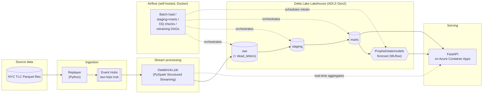

# TaxiPulse

> **Status: Work in progress.** This is an active portfolio project, built incrementally
> one phase per session. See [Roadmap](#roadmap) below for what's done and what's next.
>
> **Note on cloud provider**: this project originally targeted GCP (Pub/Sub +
> Apache Beam/Dataflow + BigQuery). That implementation is complete, tested, and
> preserved on the [`archive/gcp-beam`](https://github.com/sanogomamadou/TaxiPulse/tree/archive/gcp-beam)
> branch. The active implementation now targets **Azure** instead, after a GCP
> billing blocker made the original path impractical to deploy - the architecture
> and goals are unchanged, only the cloud services are swapped for their Azure
> equivalents.

An end-to-end real-time urban mobility data platform on Azure, built on real
NYC TLC (Taxi and Limousine Commission) trip data. TaxiPulse replays historical taxi
trips as a live event stream, processes them with PySpark Structured Streaming on
Databricks, warehouses and forecasts demand with a Delta Lake Lakehouse, orchestrates
batch and ML workflows with Airflow, and serves real-time KPIs and forecasts through a
FastAPI service on Azure Container Apps.

## Overview

- **Source data**: [NYC TLC Trip Record Data](https://www.nyc.gov/site/tlc/about/tlc-trip-record-data.page)
  (public Parquet files).
- **Replay**: a Python replayer reads historical trips and publishes them to Azure
  Event Hubs in chronological order, at a configurable speed-up factor, with optional
  late/duplicate event injection to test pipeline robustness.
- **Stream processing**: PySpark Structured Streaming on Databricks parses, validates,
  deduplicates, and windows events, computing per-zone aggregates and detecting demand
  spikes, with dead-lettering for invalid messages and explicit late-data handling via
  watermarks.
- **Warehouse**: a Delta Lake Lakehouse (raw / staging / marts) on ADLS Gen2, queried
  via Databricks SQL, with a per-zone, per-hour demand forecasting model
  (Prophet/statsmodels, tracked with MLflow).
- **Orchestration**: a self-hosted Airflow (Docker) drives batch historical loads,
  staging/marts transformations, data quality checks, and scheduled model retraining.
- **Serving**: a containerized FastAPI service exposes real-time KPIs, detected spikes,
  and demand forecasts, deployed on Azure Container Apps.
- **Infra & CI/CD**: everything is provisioned with Terraform and deployed via GitHub
  Actions, authenticating to Azure through federated identity credentials (OIDC, no
  stored secrets).

## Architecture


```mermaid
flowchart LR
    subgraph Source["Source data"]
        TLC[("NYC TLC Parquet files")]
    end

    subgraph Ingest["Ingestion"]
        Replayer["Replayer\n(Python)"]
        EventHub[["Event Hubs\ntaxi-trips hub"]]
    end

    subgraph Stream["Stream processing"]
        Databricks["Databricks job\n(PySpark Structured Streaming)"]
    end

    subgraph Warehouse["Delta Lake Lakehouse (ADLS Gen2)"]
        Raw[("raw\n(+ dead_letters)")]
        Staging[("staging")]
        Marts[("marts")]
        Forecast{{"Prophet/statsmodels\nforecast (MLflow)"}}
    end

    subgraph Orchestration["Airflow (self-hosted, Docker)"]
        DAGs["Batch load /\nstaging+marts /\nDQ checks /\nretraining DAGs"]
    end

    subgraph Serving["Serving"]
        API["FastAPI\non Azure Container Apps"]
    end

    TLC --> Replayer --> EventHub --> Databricks
    Databricks --> Raw --> Staging --> Marts
    Marts --> Forecast
    DAGs -. orchestrates .-> Raw
    DAGs -. orchestrates .-> Staging
    DAGs -. orchestrates .-> Marts
    DAGs -. schedules retrain .-> Forecast
    Marts --> API
    Forecast --> API
    Databricks -. real-time aggregates .-> API
```

## Tech stack

| Layer               | Technology                                              |
|---------------------|----------------------------------------------------------|
| Event replay        | Python, `pyarrow`, `azure-eventhub`                       |
| Messaging           | Azure Event Hubs (local: Event Hubs emulator)              |
| Stream processing   | PySpark Structured Streaming, Databricks / local `pyspark` |
| Warehouse           | Delta Lake on ADLS Gen2 (raw / staging / marts), Databricks SQL |
| Orchestration       | Apache Airflow, self-hosted (Docker Compose, local and deployed) |
| Serving API         | FastAPI, Uvicorn, Docker                                 |
| Compute (API)       | Azure Container Apps, Azure Container Registry              |
| Infrastructure      | Terraform (`azurerm` provider)                             |
| CI/CD               | GitHub Actions, Azure federated identity credentials (OIDC) |
| Quality             | ruff, pytest, pre-commit                                   |

## Getting started

### Prerequisites

- Python 3.11+
- [Make](https://www.gnu.org/software/make/)
- An Azure subscription (for later phases) — no cloud resources are required for
  local development
- To run the Spark pipeline (`pipeline/`) locally: a **Java 17+ JDK** (Spark 4.x
  requires it - set `JAVA_HOME` accordingly) and, **on Windows only**,
  [`winutils.exe` and `hadoop.dll`](https://github.com/cdarlint/winutils) on a
  `HADOOP_HOME/bin` directory that's also on `PATH` (Spark's Hadoop filesystem
  layer needs them even for purely local file paths)

### Local setup

```bash
git clone https://github.com/sanogomamadou/TaxiPulse.git
cd TaxiPulse
python -m venv .venv && source .venv/bin/activate   # or .venv\Scripts\activate on Windows
make install
cp .env.example .env   # fill in values as needed
```

### Common commands

```bash
make lint          # ruff checks
make format        # auto-fix + format
make test           # run pytest suite
make sample-data    # download a small local sample of NYC TLC trip data
make destroy        # destroy all Azure resources provisioned via Terraform
```

### Running the replayer locally

No Azure subscription is needed for this - the replayer runs against a local
Event Hubs emulator (Docker, official `azure-messaging/eventhubs-emulator` image +
Azurite).

```bash
make sample-data   # download a small TLC sample into data/sample/
make emulator-up    # start the local Event Hubs emulator + Azurite
make emulator-setup  # verify the emulator is reachable and the taxi-trips hub exists
make replay SAMPLE=data/sample/yellow_tripdata_2024-01_sample.parquet ARGS="--speedup 50000"
make emulator-down   # stop the emulator when done
```

### Running the Spark pipeline locally

`pipeline/` is a standard `spark-sql-kafka-0-10` reader against Event Hubs'
Kafka-compatible endpoint - the idiomatic way to consume Event Hubs from Spark
(the dedicated `azure-eventhubs-spark` connector is unmaintained and
incompatible with Spark 4.x). This works against real Azure Event Hubs; the
local emulator's Kafka port could not be made reachable from the host in
testing (see `pipeline/src/taxipulse_pipeline/main.py`'s docstring). The
pipeline's logic is still fully verified locally - both via unit tests
(`pipeline/tests/`, batch DataFrames) and a live Structured Streaming run
against a local file source standing in for the Kafka read step.

```bash
python -m taxipulse_pipeline.main \
    --bootstrap-servers <namespace>.servicebus.windows.net:9093 \
    --connection-string "$AZURE_EVENTHUB_CONNECTION_STRING" \
    --eventhub-name taxi-trips \
    --output-path output/zone_aggregates --dead-letter-path output/dead_letters
```

### Running the warehouse pipeline locally

No Azure subscription needed - everything reads/writes local Delta tables
under `warehouse_output/`.

```bash
make sample-data   # download a small TLC sample into data/sample/
make taxi-zones     # download the TLC zone lookup + shapefile, build the centroid reference
make warehouse-zones        # load the zone reference into stg_taxi_zones
make warehouse-batch-ingest ARGS="data/sample/yellow_tripdata_2024-01_sample.parquet"
make warehouse-staging
make warehouse-marts
make warehouse-quality       # exits non-zero if any check fails
make warehouse-forecast
```

Airflow DAGs for this pipeline live in `orchestration/dags/` - each task
shells out to the same CLI modules above. `apache-airflow` is an optional
extra (`pip install -e ".[airflow]"`, pinned to an exact version to match
its own constraints file). A full local deployment (Postgres +
LocalExecutor scheduler/webserver, Java + the warehouse's Python deps
baked into the image) is in `orchestration/Dockerfile` +
`orchestration/docker-compose.yml`:

```bash
cd orchestration
docker compose up -d
docker compose exec airflow-scheduler airflow dags unpause taxipulse_batch_pipeline
docker compose exec airflow-scheduler airflow dags trigger taxipulse_batch_pipeline
# Airflow UI: http://localhost:8080 (admin/admin, local dev only)
docker compose down
```

## Roadmap

- [x] **Phase 0** — Monorepo scaffolding, `CLAUDE.md`, README, Makefile, `pyproject.toml`,
      pre-commit hooks, TLC sample downloader, minimal CI (lint + tests).
- [x] **Phase 1 (GCP/Beam, archived)** — Replayer, local Pub/Sub emulator, Apache
      Beam pipeline on DirectRunner (parsing, dead-letter, dedup, watermarks/
      allowed lateness/triggers, sliding-window aggregates, spike detection), with
      tests. Fully built and live-tested; preserved on
      [`archive/gcp-beam`](https://github.com/sanogomamadou/TaxiPulse/tree/archive/gcp-beam).
- [x] **Phase 2 (Azure pivot) — complete, verified end-to-end against real Azure** —
      Replayer rewritten for Event Hubs, local Event Hubs emulator, stream
      processing rebuilt in PySpark Structured Streaming (parsing/dead-letter,
      watermark, dedup, sliding-window aggregates, spike detection, Delta
      Lake sink), Terraform for Event Hubs / ADLS Gen2 / Databricks /
      least-privilege identities. Verified locally (unit tests, a live
      Structured Streaming run) and deployed for real against an Azure for
      Students subscription: the replayer published real events to real
      Event Hubs, and the pipeline connected via Kafka protocol and ran
      error-free (after fixing an Event Hubs tier gap - Basic doesn't
      support Kafka, only Standard+). Infrastructure was torn down
      afterward (`terraform destroy`, confirmed clean) to control cost.
- [x] **Phase 3 (local build) — code-complete, verified end-to-end against
      a real local Airflow deployment** — Delta Lake raw/staging/marts, a
      zone geographic reference (TLC zone lookup + centroids), per-zone
      demand forecasting (Prophet via a Spark grouped UDF, MLflow-tracked),
      lightweight data quality checks, and two Airflow DAGs (daily batch
      load + weekly forecast retrain). Ran the full chain twice: once
      directly on the host, and once for real through a Dockerized Airflow
      (Postgres + LocalExecutor scheduler/webserver, both DAGs triggered
      and run to completion) - 2,968 trips ingested → staged → 2,727 hourly
      / 1,187 daily zone-demand rows → all 5 quality checks passed → 10
      zones forecast (avg MAE 0.28, avg MAPE 22.4%). Running it through a
      second, genuinely different environment caught a real idempotency
      bug (the trip ID hash included the source file's absolute path, so
      the same file read from a container mount double-counted every trip)
      that a single-environment run could never have exposed. A short real
      Databricks deployment is deferred to the next live-cloud session.
- [ ] **Phase 4** — FastAPI service, Docker, Azure Container Apps deployment.
- [ ] **Phase 5** — Full CI/CD, Azure federated identity credentials (OIDC).
- [ ] **Phase 6** — Performance, model quality, and cost measurements; README
      finalization.

## Measured results

_To be filled in during Phase 6: throughput (messages/s), end-to-end latency, data
volume processed, forecasting model accuracy (MAE / MAPE), and infrastructure cost._

## License

MIT
